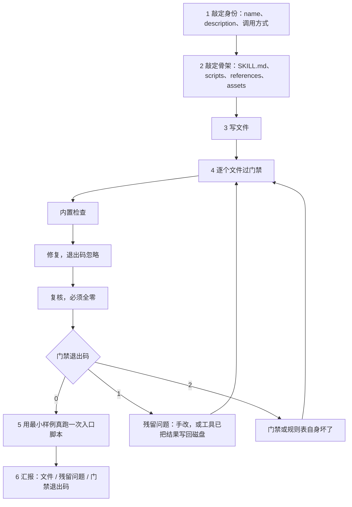
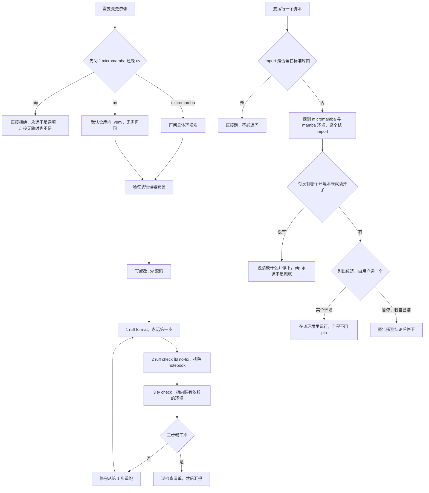
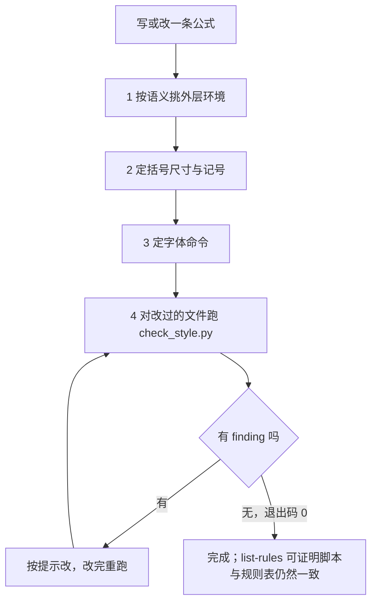
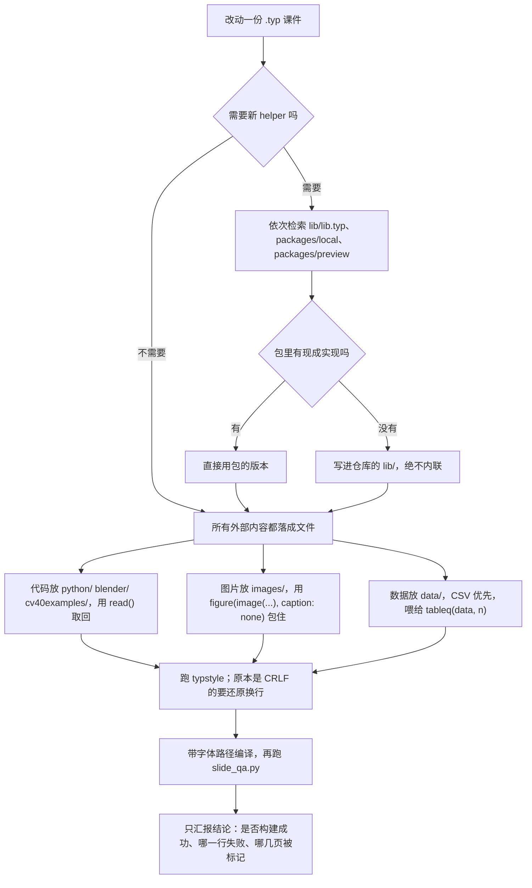
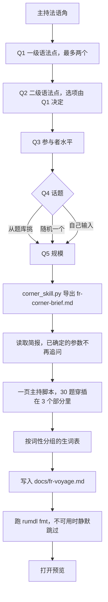
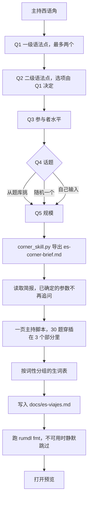
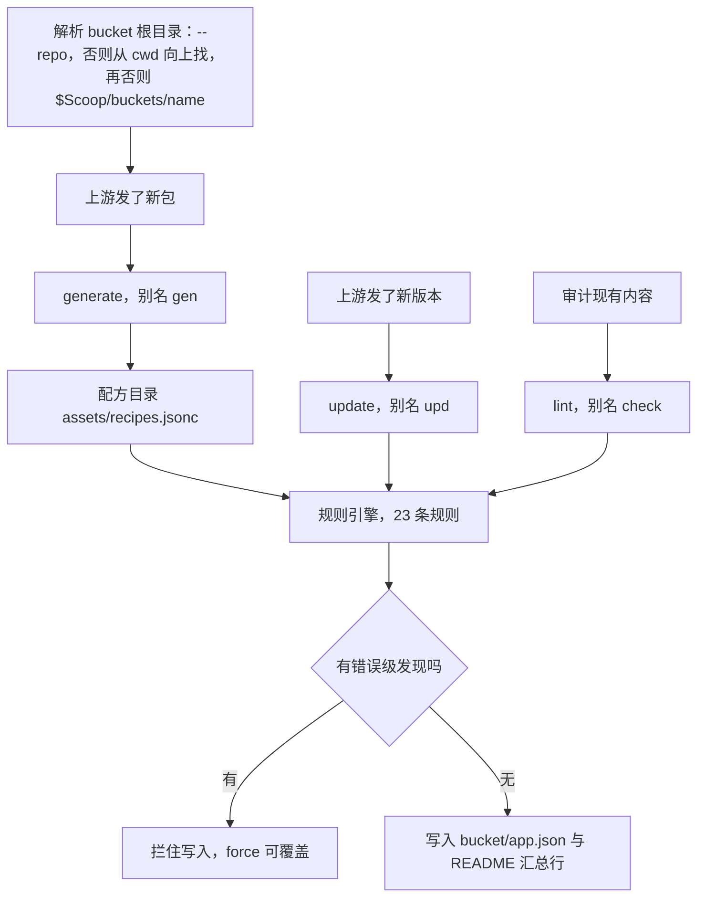
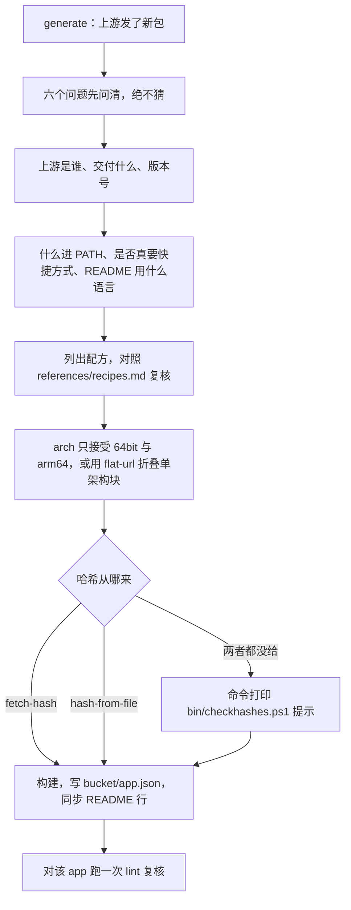
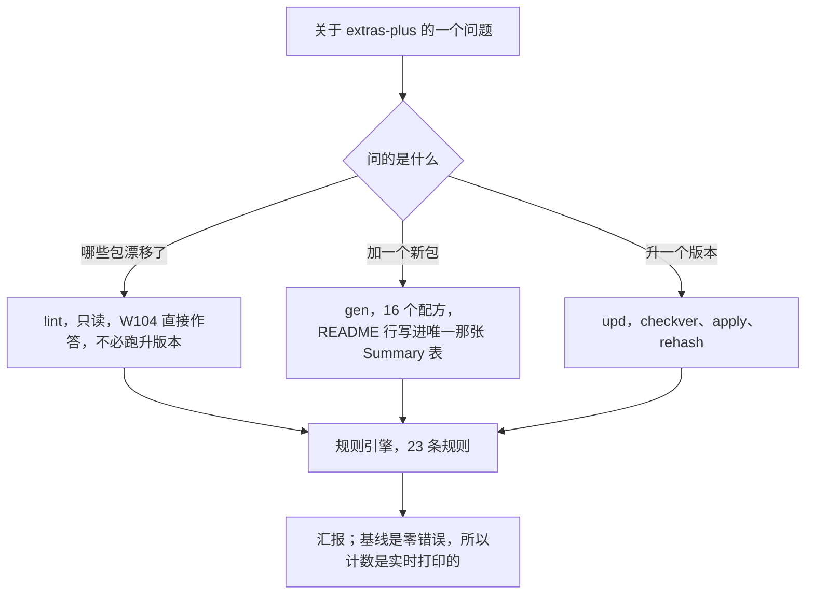
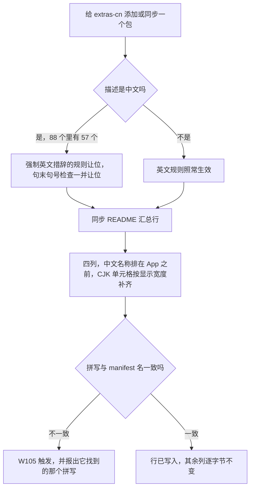

# skills

[English](README.en.md)

一组 我的日常 Agent Skill 的集合。

每个 skill 都是一个自包含的包：一份由模型按需加载的 `SKILL.md`，外加 `scripts/`（确定性的代码）、`references/`（长文档，按需读取）和 `assets/`（模板与数据，永不进入上下文）。skill 的 frontmatter 里 `name` 必须等于其目录名，否则不会被加载。

本仓库是主要工作副本。一个 skill 只要落在 WorkBuddy 会扫描的 skills 目录里，就对应用可用，而两个候选位置的作用范围不同：

| 层级   | 路径                                  | 可用范围                         |
| :----- | :------------------------------------ | :------------------------------- |
| 用户级 | `~/.workbuddy/skills/<name>/`         | 本机所有项目                     |
| 项目级 | `<project>/.workbuddy/skills/<name>/` | 仅该项目，且随项目一起分享给他人 |

skill 的目录名必须与 frontmatter 里的 `name` 一致，否则不会被加载。

## 安装 skill

### 把包放到应用会扫描的位置

最简做法是复制——WorkBuddy 在每次启动时扫描目录树，因此单纯复制即可生效，无需其他步骤：

```bash
cp -r <skill> ~/.workbuddy/skills/<skill>            # 用户级，所有项目可用
cp -r <skill> <project>/.workbuddy/skills/<skill>    # 项目级，仅该仓库可用
```

若想只保留一份可编辑的副本，用链接指向它而不是复制：

```powershell
# Windows：目录 junction 不需要管理员权限
New-Item -ItemType Junction -Path "$env:USERPROFILE\.workbuddy\skills\<skill>" -Target "<repo>\<skill>"
```

```bash
# macOS / Linux
ln -s "<repo>/<skill>" ~/.workbuddy/skills/<skill>
```

### 用 npx 安装

若目标 skill 已存在于公开的 Git 仓库或市场，`skills` CLI 可以一步完成抓取与放置，无需手工复制：

```bash
npx skills find "关键词"                          # 交互式搜索
npx skills add <owner>/<repo> -g -y              # 装仓库内全部 skill，用户级
npx skills add <owner>/<repo>@<skill-name> -g -y # 只装指定的一个
npx skills add <owner>/<repo> -y                 # 项目级（默认行为）
```

## 调用 skill

这些 skill 都不需要显式命令来触发。九个都没有声明 `disable-model-invocation`，因此 WorkBuddy 是拿你的措辞去匹配 `description` 及其触发词，从而决定加载哪一个。由此推出两件事：**用 skill 已经列出的词汇来表述需求**，是让它被加载的关键；而当一句话可能落在多个 skill 上时，**直接点名**才是强制指定它的手段。

下面的例子都用各 skill 自己的触发词。凡是封装了 CLI 的 skill，也会给出它将要构造的调用形式——很多时候，知道一个精确调用的形状比知道触发词更有用。

### skill-draft

触发词：*create a skill、new skill、write SKILL.md、save this workflow as a skill、edit a skill、validate a skill package、add a file type to the gate。*

```text
把我刚才做的事整理成一个 skill。
```

```text
建一个"旋转 PDF 页面"的 skill，然后对它跑一遍门禁。
```

```text
把 .toml 加进门禁的规则表，用 taplo。
```

第三条是扩展路径：新增一种文件类型通常只需编辑 `scripts/file-types.json` 一处，不必改代码，而这个 skill 知道这一点。

### project-py

触发词：*Python、py、ruff、ty、lint、类型检查、包管理、micromamba、uv、matplotlib、subplots。*

```text
给这些图加上误差棒，顺便把绘图代码收拾干净。
```

```text
下一节要用 scipy，装一下。
```

```text
对 python/ 目录跑一遍 lint 和类型检查。
```

```text
跑一下 code/fit_model.py。
```

第二条值得单独说明：这个 skill 在问清楚你要 `micromamba` 还是 `uv`、以及具体环境名之前，不会安装任何东西——`pip install` 会被直接拒绝，而且「这个包哪个环境都没有」是停下汇报的理由，不是动用 pip 的许可。第四条是同一道门禁的运行侧：只要脚本的 import 越出标准库就不会直接跑，而是先探测本机环境、再由你在交互提示里选定；那个提示永远留一个「暂停，我自己装」的出口，选它是把装包交回给你，而不是打开 pip 这道门。

### project-tex

触发词：*LaTeX、latex、tex、公式、数学公式、矩阵、行列式、方程组、分段函数、begin、aligned、bmatrix、vmatrix、mathrm、atop。*

```text
把这段推导整理成多行公式，按语义挑环境。
```

```text
写一下这个分段函数，再配一个矩阵。
```

```text
这段公式检查一下写法。
```

第三条是它的机械那一半：会执行 `python <this skill dir>/scripts/check_style.py <文件>`，该脚本只报告不改写，干净时退出码为 0。它既认 Markdown 也认 `.tex`——能从 `$…$`、`$$…$$`、`\(…\)`、`\[…\]` 以及 `latex` 围栏代码块里取出公式，所以讲义笔记和源文件受到的审查是同一套。

### project-typ

触发词：*Typst、typ、讲义、课件、幻灯片、touying、qooklet、.typ、figure、tableq、read()。*

```text
给图像处理那份课件加一节直方图均衡化。
```

```text
这一页溢出了，检查一下版式并修好。
```

```text
把这段代码做成两栏幻灯片，右边配输出图。
```

这里最要紧的两条提示正好对应两条规则：任何"新定义一个 helper"的请求都应该先走一遍查包；第三个例子必须落成一个 `python/` 下的真实文件、通过 `read()` 引入，绝不能内联进 `.typ`。

### scoop-main-plus

触发词：*scoop manifest、generate / update / lint manifest、checkver、autoupdate、hash、version bump、Excavator、main-plus、scoop-main-plus。*

```text
给 main-plus 加上新版 ripgrep 的 manifest。
```

```text
把 main-plus 里所有包都升一遍版本并重算 hash。
```

```text
检查一下 main-plus bucket。
```

底层对应的是 `gen --name <app> --recipe <recipe>`、`upd --all --checkver --apply --rehash` 和 `lint`；不传 `--repo` 时 bucket 从 `$Scoop` 解析。

### scoop-extras-plus

触发词：与 main-plus 同一组，把 *main-plus* 换成 *scoop-extras-plus*。

```text
给新版 IsoBuster 加一个 manifest。
```

```text
extras-plus 里哪些包的版本和 URL 已经对不上了？
```

```text
把我刚加的那几个包同步进 README 总结表。
```

第二条是 lint 规则能直接回答的只读问题（`W104`），比跑一次版本升格审计更省事。

### scoop-extras-cn

触发词：与上面同一组，再加 *extras-cn* 与 *scoop-extras-cn*，以及中文形式 *生成 / 更新 / 检查 manifest。*

```text
给 extras-cn 加一个新包，中文名是「飞书」。
```

```text
检查一下 extras-cn 的 README 总结表，哪些包没列进去？
```

```text
把 extras-cn 里所有包检查一遍，并把格式问题修掉。
```

第一条会用到这个 bucket 独有的四列 README 与 `中文名称` 单元格；第二条会命中 `W105`，它的提示会报出实际找到的拼写，这正是让"展示名与 manifest 名不一致"这类问题无需手工翻 README 就能定位的原因。

### anchor-french

触发词：*法语角、French corner、主持法语角、法语口语、法语讨论、法语话题、法语会话。*

```text
下周的法语角帮我准备一下，练条件式。
```

```text
主持法语角，话题随机一个。
```

```text
这周法语角是「环保」，参与者水平混合。
```

这里的重点是 intake 而非措辞：它在动笔之前先问语法点、水平和规模，而且不会替你脑补语法点。第一条自己给了语法点，于是跳过该题；第二条走 `🎲 随机` 话题来源；第三条直接点明水平，跳过水平那一问。

### anchor-spanish

触发词：*西班牙语角、西语角、Spanish corner、主持西语角、西班牙语口语、西班牙语讨论、西班牙语话题、西班牙语会话。*

```text
帮我准备这周的西语角，练虚拟式。
```

```text
主持西语角，话题随机一个。
```

```text
西语角话题是「家庭与朋友」，B2，8 个人。
```

它与 `anchor-french` 架构相同，主要差别在考试等级体系——一个用 DELE，一个用 DELF/DALF——以及各自独立的话题库。第三条把问题一次答全，正是文档里写明会被跳过的情形。

## 目录

| 分组         | Skill                                     | 一句话                                |
| :----------- | :---------------------------------------- | :------------------------------------ |
| 工具         | [`skill-draft`](#skill-draft)             | 构建 skill 包，并为其中每个文件设门禁 |
| 项目规范     | [`project-py`](#project-py)               | Python：环境、包管理、风格、ruff + ty |
| 项目规范     | [`project-tex`](#project-tex)             | LaTeX 数学公式：环境、括号、记号      |
| 项目规范     | [`project-typ`](#project-typ)             | Typst 课件：资源、版式、编译          |
| 语言角       | [`anchor-french`](#anchor-french)         | 法语角主持资料包                      |
| 语言角       | [`anchor-spanish`](#anchor-spanish)       | 西班牙语角主持资料包                  |
| Scoop bucket | [`scoop-main-plus`](#scoop-main-plus)     | Main-Plus bucket 的 manifest          |
| Scoop bucket | [`scoop-extras-plus`](#scoop-extras-plus) | Extras-Plus bucket 的 manifest        |
| Scoop bucket | [`scoop-extras-cn`](#scoop-extras-cn)     | Extras-CN bucket 的 manifest          |

下面每个 skill 小节都配一张 mermaid 流程图，画的是模型实际走的那条路。若某个分组本身是同一套架构的多次移植，共有部分只画一次，各成员的图只画它自己多出来的那一段。

## 工具

### skill-draft

把一段工作流或一块领域知识变成 Skill 包，并让其中每个文件在**落盘之前**就通过质量门禁。

铁律是「门禁不过，文件就不算完成」，且每次写入后立刻重跑门禁。一条命令驱动全部：

```bash
python <this skill dir>/scripts/verify.py <file-or-dir>...
```

每种文件类型都走三段式流水线——内置检查、修复、复核——复核阶段必须退出码为零。当前覆盖范围：

| 类型                       | 工具                          |
| :------------------------- | :---------------------------- |
| `.py`                      | ruff + ty，外加进程内语法编译 |
| `.md`                      | rumdl                         |
| `.json` / `.jsonc`         | 解析校验                      |
| `.ts` / `.js` 系           | oxlint + oxfmt                |
| `.css` / `.scss` / `.less` | oxfmt                         |
| `.png`                     | oxipng + chunk/CRC 完整性复检 |

新增文件类型通常只需改 `scripts/file-types.json`，无需改代码；进程内检查写进 `scripts/checkers.py`。整个包只用 Python 标准库，因此任何机器上都能跑。

`SKILL.md` 里还有一节很长的「门禁细节」，记录了那些花了真实调试时间的坑——为什么 `oxlint` 需要 `--deny-warnings`、为什么 `oxipng` 的退出码不可信、为什么 `.jsonc` 这个后缀有时是刻意为之而非拼错。

流程如下，回跳门禁的那一环画在它真正发生的位置：



## 项目规范

这三个 skill 为另一个独立仓库（lectures）编码内部约定。前两个是被动的：它们描述约定、动手前先问，但不自带工具。`project-tex` 是其中的例外——它自带检查脚本，因此也有机械执行的一半。

### project-py

写 `.py` 源码的规则。Notebook 明确不在范围内。

- **包管理器是硬门禁。** 禁止 `pip install`——即使本机所有环境里都没有这个包。依赖只能通过 `micromamba` 或 `uv` 变更，且先与用户确认选哪个——用 `micromamba` 时，还要在动手前问清具体的环境名。两条路都不通就停下并汇报探测结果与缺什么，**`pip` 不是兜底**。
- **运行同样设门禁。** 只要脚本的 import 越出标准库，就不会直接跑——先探测本机的 `micromamba` / `mamba` 环境，再由你在交互提示里选定；该提示永远带一个「暂停，我自己装」的出口，选中即结束任务，而不是悄悄装点什么——选它意味着把装包交回给你，而不是解禁 `pip`。
- **风格。** 用 `enumerate()` / `zip()` 迭代，绝不用 `range(len())`；Matplotlib 走面向对象接口并设 `constrained_layout=True`；装饰批量通过 `ax.set(...)`，spines 作为单个列表传入。
- **静态检查顺序固定：format → check → ty。** 格式化不是可选项，因为 `ruff check` 过了并不代表格式没问题。`ty` 必须指向一个确实装了依赖的解释器，否则会刷出一大片假的 `unresolved-import` 告警。
- **任何地方都不写绝对路径、不写固定版本号**——文档、脚本、配置（含 `ty.toml`）一视同仁。两者都在运行时解析，因为硬编码的路径在机器一变的那一刻就变成错误信息。

`references/toolchain.md` 存放命令速查与隔离注意事项。

三条路进入同一个 skill：变更依赖、普通改动，以及要运行的脚本：



### project-tex

LaTeX 数学公式的内部风格。每条规则都是「不写 X，改写 Y」的形式，所以这个 skill 存在的意义就是拦住那几个反复回潮的坏习惯：

- **按语义挑环境。** 多行公式、矩阵、分段函数要用能说明自己是什么的环境——`gathered`、`gather`、`aligned`、`cases`、`vmatrix`、`bmatrix`——绝不用没有语义的 `array`。如果说不出某条公式为什么用它那个环境，那就是选错了。
- **括号尺寸显式写出。** `\left…\right` 换成固定档的 `\big` / `\Big` / `\bigg` / `\Bigg`，按内容挑一档，这样括号在反复编辑之间保持稳定，而不是默默改变大小。
- **一种记号一种写法。** 转置用 `^{\top}`，极限用 `\to`，用 `\underset{}{}` 而非 `\limits_`，用 `\mathrm` / `\mathbf` / `\mathit` 取代旧的 `{\rm }` / `{\bf }` / `{\it }`。每个 `\underset` 都写全两个参数位，不用的一侧留空花括号。
- **写完跑检查。** `scripts/check_style.py` 是规则表的机械孪生，共用同一套九个 id，只报告不改写；退出码 0 即为完成标准。

`references/examples.md` 存放每种环境可整块照抄的样例，这也是单靠规则表最难推断的部分。

四步，检查脚本就是完成标准：



这个检查脚本本身值得单说一句：它既读 Markdown 也读 `.tex`，从 `$…$`、`$$…$$`、`\(…\)`、`\[…\]` 以及 `latex` 代码块里抽取公式，其余部分以不破坏字符偏移的方式置空，因此报出的位置仍能对上正确的行列。`--list-rules` 兼作一致性审计：如果某个 id 只存在于脚本中而没写进 `SKILL.md`，它会失败。

### project-typ

编写与修改 Typst 课件的规则。

- **写辅助函数之前先查包。** 在定义任何自定义函数之前，先去 `qooklet`、`touying-quick` 和 `theorion` 里找现成实现——多数版式需求（表格、代码块、提示框、公式编号、图表引用）都已被解决，重造一遍只会带来不一致的排版。
- **所有外部内容都落在文件里，绝不内联。** 代码放到 `python/`、`blender/` 或 `cv40examples/`，再通过 `read()` 引入；图片放到 `images/`，并用 `figure(image(...), caption: none)` 包起来；数据放到 `data/`，尽量用 CSV，供 `tableq(data, k)` 使用。路径一律相对于仓库根目录。
- **版式。** 定高两栏用 `columns()` 并在两栏之间显式写 `#colbreak()`，每栏各自包在 `#[ … ]` 里——漏掉 `#colbreak()` 会静默改变版式，因为 `columns()` 是流式的而非定位式的。
- **散文不许切碎。** 中文长句保持完整，断句用逗号和分号，不用句号。
- **不要展示 PDF。** 编译只用于验证。报告结论——是否构建成功、哪一行失败、`slide_qa.py` 标记了哪几页——而不是把 PDF 推到用户编辑器里。

`references/packages.md` 记录三个包导出的符号；`references/syntax.md` 收集高频 Typst 写法与坑。

课件是最后才碰的东西，一切外部内容先落成文件：



## 语言角

两个姊妹 skill，为每周一次的语言角生成主持资料：一页沉浸式外文主持脚本，三十个讨论问题穿插在主持词里而不单列成块，外加按词性分组的生词表。两者面向同一套固定规格——十人以内、九十分钟的平等圆桌，不含辅导、不分小组、不布置作业。

它们是同一个包移植到两种语言，因此共用文件布局（`scripts/corner_config.py`、`corner_skill.py`、`corner_audit.py`）、同一组三条命令，以及同样的 intake 形态。不同的只是语言本身、各自标注的考试等级体系，以及话题库。

|          | `anchor-french`                | `anchor-spanish`               |
| :------- | :----------------------------- | :----------------------------- |
| 语言     | 仅法语                         | 仅西班牙语                     |
| 考试等级 | DELF / DALF                    | DELE                           |
| 水平区间 | B1–C2，含混合                  | B1–C2，含混合                  |
| 产出     | `docs/fr-<topic>.md`           | `docs/es-<topic>.md`           |
| 配置     | `assets/fr-corner-config.json` | `assets/es-corner-config.json` |

**配置文件是唯一数据源。** 语法点、水平、规模、话题库与话题维度、时间分配、词汇量目标、考试等级体系、输出路径模板，全都存放在该包唯一的那份 JSON 资产里；`SKILL.md` 只描述流程、风格与方法论，自身不携带任何选项数据。增删选项意味着只改 JSON，不动其他任何文件。

**每个包只服务一种语言，这是刻意的。** 两者都不在运行时按语言分派。两个构建之间唯一允许的差异是 `corner_config.py` 顶部那三个身份常量——包名、语言键、配置文件名——而审计会在某个包引用了另一个包的配置时报错。

**三条命令，全部离线、全部只用标准库。** 在包根目录执行：

| 命令                              | 职责                                       |
| :-------------------------------- | :----------------------------------------- |
| `python scripts/corner_config.py` | 加载并校验 JSON，然后打印解析结果          |
| `python scripts/corner_skill.py`  | 驱动 intake 状态机并导出简报               |
| `python scripts/corner_audit.py`  | 审计 schema、身份、文档 ↔ 配置、跨语言纯度 |

`corner_skill.py selftest` 检查推荐配对，而不是启动一次 intake。

**intake 先问后写。** 提问编排——顺序、类型、依赖、每题上限，以及超过六个选项时如何拆成子问题——来自配置而非模型自行判断。所有选项都可点击勾选，二级语法题只有在一级已回答后才展开，而你若在消息里已经给出某个参数，对应那一问会被跳过而不是再问一遍。

### anchor-french

法语角的主持资料包，按 DELF / DALF（B1–C2）标注。提问编排走五问——一级语法点（最多两个）、据其衍生的二级语法点、参与者水平、话题、规模——其中话题那一问提供三条路径：从题库挑选、随机取一个，或自行输入。

intake 是一台由配置驱动的状态机，而不是靠模型自行判断：



### anchor-spanish

西班牙语角的主持资料包，同一条流水线，但按 DELE 标注。它的话题库是自有的，而不是法语库的翻译版；语法点树、词性分组名与词汇量目标也各自独立，而 intake 跑的仍是同一套五问题编排。

同一台状态机，按 DELE 标注：



## Scoop bucket

三个姊妹 skill，把「上游发了新包」或「上游发了新版本」变成一条命令。它们共用一套架构：配方目录、共享库、三命令 CLI、自检，以及一个在写入前校验结果的规则引擎。

它们只在各自目标仓库的强制要求下才产生差异。两个 extras 构建是同一个 skill 移植到两个 bucket，README 约定不同、主要包形态也不同；`scoop-extras-cn` 还额外地在自己 `SKILL.md` 里记录了它与 `scoop-extras-plus` 的分歧。

|             | `scoop-main-plus`          | `scoop-extras-plus`          | `scoop-extras-cn`          |
| :---------- | :------------------------- | :--------------------------- | :------------------------- |
| 目标 bucket | `$Scoop/buckets/main-plus` | `$Scoop/buckets/extras-plus` | `$Scoop/buckets/extras-cn` |
| 配方数      | 18                         | 16                           | 16                         |
| 规则数      | 23                         | 23                           | 23                         |
| README 语言 | 英文                       | 英文                         | 中文                       |

**共同形态。** 三者都对外暴露同样三条触发命令：

| 命令       | 别名    | 职责                               |
| :--------- | :------ | :--------------------------------- |
| `generate` | `gen`   | 按配方构建 manifest 并填好字段     |
| `update`   | `upd`   | 改字段、升版本、重算哈希、探测上游 |
| `lint`     | `check` | 跑规则目录并修复格式               |

除 `--checkver`、`--fetch-hash` 与 `--rehash` 外全部离线。只用 Python 标准库，且仓库的 Python 目标版本为 3.14；脚本未使用任何受版本限制的语法，因此更早的 3.x 也能解析。脚本自行推导包根目录，可从任意工作目录执行。

三条命令背后是同一条管线：



### 共同保证

- **bucket 根目录在运行时解析**，绝不写死。展开顺序为 `--repo <path>`、再向上遍历当前目录、最后落到 `$Scoop` 下该 bucket 自身的安装副本。任何包里的任何文件都不存展开后的 Scoop 路径，一旦出现字面量自检就会失败。
- **规则引擎先于写入运行。** 错误级发现会拦住写入，`--force` 可覆盖。`--dry-run` 预览，`--print-json` 输出结果。
- **已有键序保持不变。** `update` 只把*新增*字段插到其规范位置；要整体重排需显式 `--reorder`。
- **哈希从不凭空捏造。** 要么 `--fetch-hash` 流式下载并计算，要么 `--hash-from-file` 用磁盘上已有的包，要么运行结束打印提示，让你后续用 `bin/checkhashes.ps1` 处理。
- **README 是受控的。** 同步只碰它认得的那几张汇总表，其余列保持逐字节不变。缺少小节时会跳过同步并给出说明，而不是把文件改坏。
- **行尾全局为 CRLF。** `.editorconfig` 对 `[*]` 设了 `end_of_line = crlf`，`.gitattributes` 让工作区与之保持一致。完整的 `lint` 会遍历目录树，报出每一个不是 CRLF 的文本文件（`W112`）；这一遍是只读的，`--fix-format` 只重写 skill 自己拥有的两样东西：`bucket/*.json` 与 `README.md`。
- **不支持 32bit。** `arch` 只接受 `64bit` 与 `arm64`，因此 `url32` / `hash32` 既不接受也不产出。

写入目标永远是 `<repo>/bucket/<app>.json` 加上 README 那一行；`bin/`、`scripts/` 与 `.github/` 属于 Scoop 及各仓库 CI，绝不写入——`W112` 那一遍会读取并报告它们，但不动它们。

### scoop-main-plus

**Main-Plus** bucket 的 manifest，以 bin 为主：40 个包里 39 个通过 `bin` 安装，且完全没有声明 `shortcuts`。出现快捷方式是例外，说明该包并非真正的 CLI 工具。未给 `--repo` 时，该 bucket 从任意工作目录都能解析到 `$Scoop/buckets/main-plus`。

`generate` 会先敲定六个问题——上游、交付内容、版本、什么进 PATH、是否真要快捷方式、README 用什么语言实现——并且是问而不是猜。这个 bucket 输出规范键序，用 `--flat-url` 折叠单架构的 `architecture` 块，并在 `references/coverage.md` 里为它的 18 个配方逐一记录入选依据。

`generate` 先问再建，哈希有三个正当来源：



### scoop-extras-plus

**Extras-Plus** bucket 的 manifest（56 个 manifest，面向英文）。十六个配方；README 有一张 `## ⭐️ Summary` 表横跨五个 `###` 小节，三列为 `App / Auto-Update ? / Note`。

基线是**整个 bucket 零错误级发现**。`lint` 打印实时计数而非冻结数字，因为该 bucket 会随每次 autoupdate 提交而增长。`SKILL.md` 列出了迄今发现的真实问题，每条都标出是哪个规则抓到的——URL 里钉的版本已与 `version` 不符、Scoop 不接受的 `md5:` 哈希前缀，以及若干处与 manifest 名漂移了的 README 拼写。

关于这个 bucket 的多数问题，`lint` 一个命令就能答：



### scoop-extras-cn

**Extras-CN** bucket 的 manifest（88 个 manifest，面向中文）。配方目录、构建器、规范键序都与 Extras-Plus 构建相同；差异只来自这个 bucket 实际施加的约束，`SKILL.md` 把它们全部列成表。

让它与众不同的几点：

- **双语描述。** 88 个 manifest 里有 57 个用中文，因此强制英文措辞的规则会对任何含 CJK 的字符串让位——句末句号检查也一并让位，因为中文句子以 `。` 结尾是正当的。
- **四列 README**（`中文名称` 在 `App` 之前），CJK 单元格按显示宽度补齐，分布在 `跨平台` / `Win 专属` / `开源镜像` 之下，另有一张两列的纯文本镜像表。
- **一条在别处是死代码的规则。** README 检查原先以英文字面标题 `## ⭐️ Summary` 为门，而本仓库写作 `## ⭐️ 总结`，于是它从未触发过。改成以「README 里有汇总表」为门之后，它翻出 35 处发现，干净地分成 17 条稳定约定与 18 处真实的 README 缺失——这很好地说明了为什么「谁也过不了的检查」比没有检查更糟。

两个上游规则修复被带进了这个构建，因为它们是潜在 bug 而非仓库特有选择：`jsonpath` / `xpath` 的正则要求，以及一个过度转义、永远匹配不上的递归删除模式。

差异最集中的地方是 README 那条路：



## 维护一个 skill

每个 skill 都能离线自检：

```bash
python scripts/sm_selftest.py            # Scoop 系 skill：完整自检
python scripts/verify.py .               # skill-draft：为每个文件设门禁
```

这些自检不是装饰。它们双向强制配方 ↔ 构建器覆盖、文档 ↔ 代码一致（规则表必须与代码逐字相符）、针对真实 bucket 的往返序列化、README 同步幂等，以及「skill 的 `name` 必须等于其目录名」这条规则。

### 动手编辑前值得知道的两条约定

**绝不要给 Scoop 系 skill 添加 `.json` 数据文件。** bucket CI 会把仓库里每个*变更过的* `.json` 都拿去按 Scoop 的 manifest schema 校验——而且是全仓库范围的，因为变更文件列表忽略了它的路径过滤。skill 里一个非 manifest 的 `.json` 就会让 CI 变红。这就是配方目录以 `assets/recipes.jsonc` 交付的原因：`.jsonc` 后缀是刻意的规避，而其内容保持严格 JSON，不使用注释。

**绝不要把机器本地绝对路径写进 skill。** 包会被复制和移植，硬编码路径在复制的那一刻就变错。引用 skill 自身用 `<this skill dir>` 占位符，引用家目录用 `~`，工具与环境位置一律运行时解析。`skill-draft` 的 `no-local-paths` 检查为此兜底。
