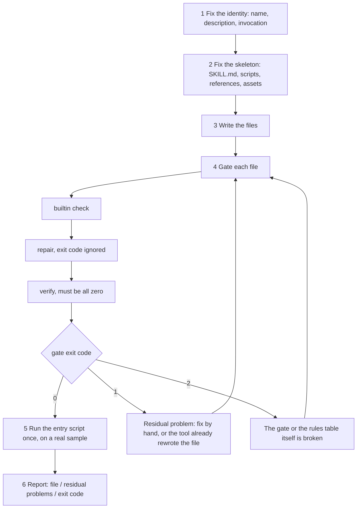
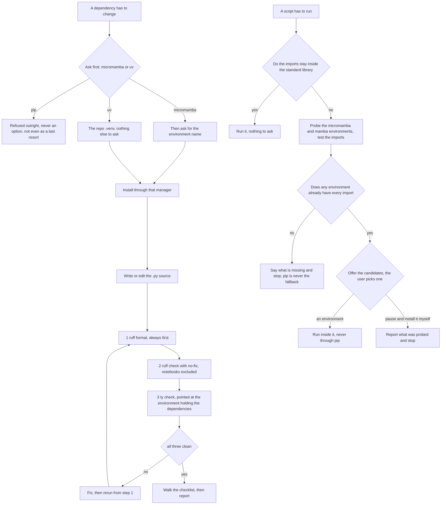
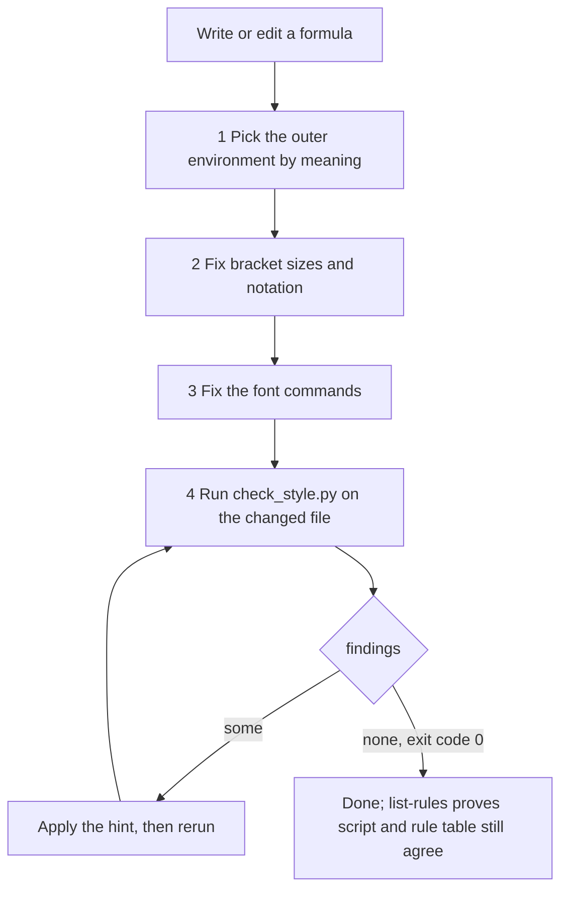
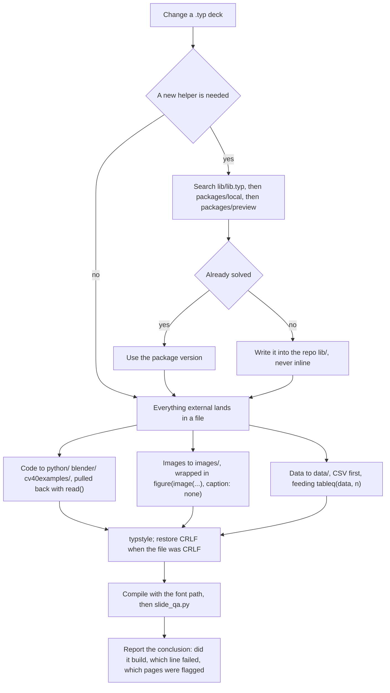
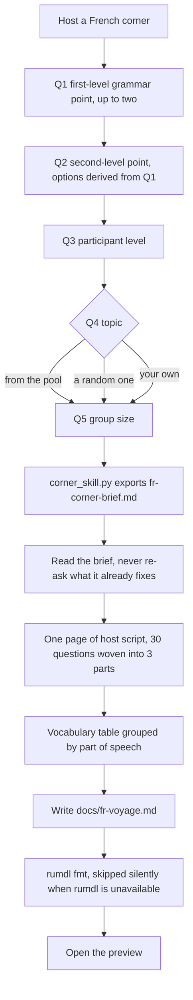
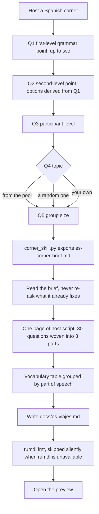
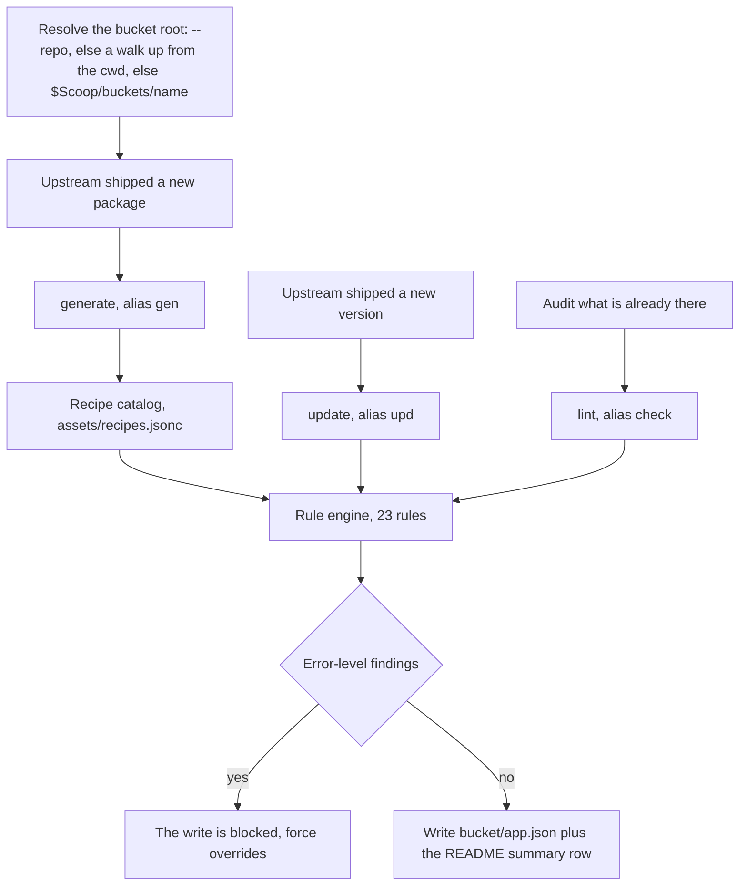
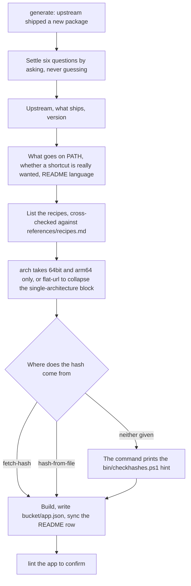
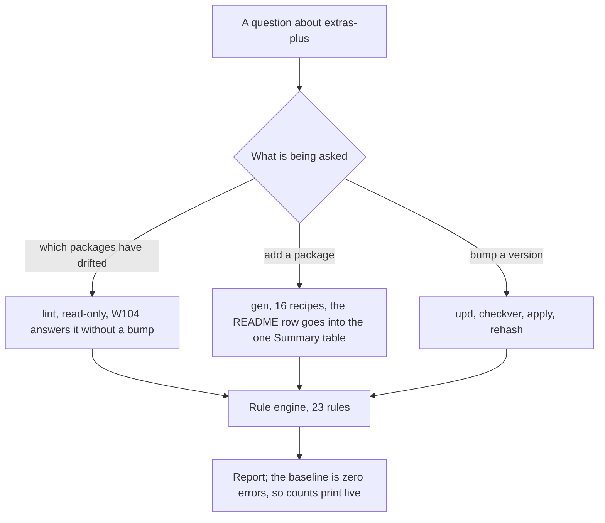
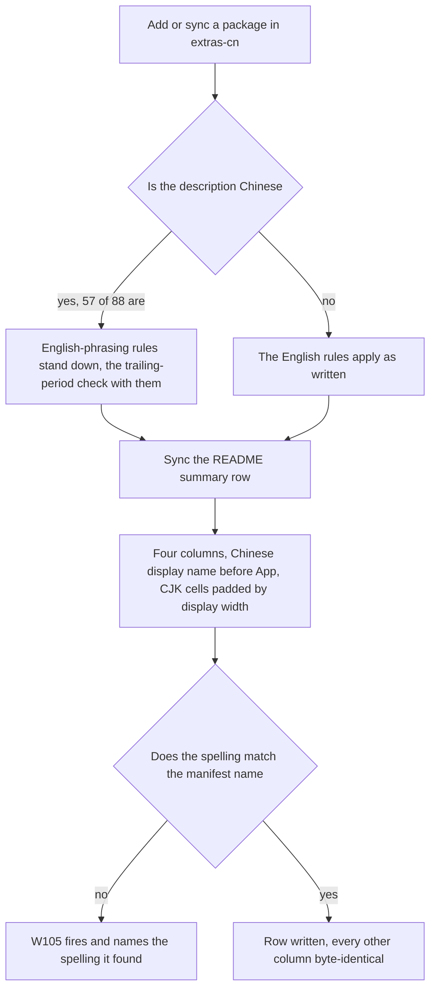

# skills

[中文](README.zh.md)

A collection of my daily Agent Skills.

Each skill is a self-contained package: a `SKILL.md` that the model loads on demand, plus `scripts/` (deterministic code), `references/` (long specs, read only when needed) and `assets/` (templates and data that never enter context). A skill's `name` in its frontmatter must equal its directory name, or it will not load.

This repo is the main working copy. A skill becomes available to WorkBuddy once it sits in a skills directory the app scans, and the two candidate locations differ in scope:

| Level   | Path                                  | Availability                                                   |
| :------ | :------------------------------------ | :------------------------------------------------------------- |
| User    | `~/.workbuddy/skills/<name>/`         | Every project on this machine                                  |
| Project | `<project>/.workbuddy/skills/<name>/` | That project only, and shared with anyone who gets the project |

A skill's directory name and its frontmatter `name` must match, or it will not load.

## Installing a skill

### Put the package where the app looks

The simplest install is a copy — WorkBuddy scans the directory tree on each launch, so a plain copy works with no further steps:

```bash
cp -r <skill> ~/.workbuddy/skills/<skill>            # user level, all projects
cp -r <skill> <project>/.workbuddy/skills/<skill>    # project level, that repo only
```

To keep one editable copy instead, link to it rather than copying:

```powershell
# Windows: a directory junction needs no administrator rights
New-Item -ItemType Junction -Path "$env:USERPROFILE\.workbuddy\skills\<skill>" -Target "<repo>\<skill>"
```

```bash
# macOS / Linux
ln -s "<repo>/<skill>" ~/.workbuddy/skills/<skill>
```

### Install with npx

For a skill that already lives in a public Git repository or on a marketplace, the `skills` CLI does the fetch and the placement in one step, so nothing has to be copied by hand:

```bash
npx skills find "keyword"                        # search interactively
npx skills add <owner>/<repo> -g -y              # every skill in a repo, user level
npx skills add <owner>/<repo>@<skill-name> -g -y # one named skill
npx skills add <owner>/<repo> -y                 # project level (the default)
```

## Using a skill

None of these skills needs an explicit command to fire. None declares `disable-model-invocation`, so WorkBuddy loads one by matching your wording against the `description` and its trigger words. Two things follow from that: phrasing the request in the vocabulary the skill already lists is what makes it load, and naming the skill outright is the way to force it when a request could plausibly match more than one.

The examples below use each skill's own trigger words. Where a skill wraps a CLI, the invocation it will build is shown too, since knowing the shape of an exact call is often more useful than knowing the trigger phrase.

### skill-draft

Triggers: *create a skill, new skill, write SKILL.md, save this workflow as a skill, edit a skill, validate a skill package, add a file type to the gate.*

```text
Walk through what I just did and save it as a skill.
```

```text
Create a skill for rotating PDF pages, then run the gate on it.
```

```text
Add .toml to the gate's rules table, for taplo.
```

The third one is the extension path: adding a file type normally means editing `scripts/file-types.json` alone, with no code change, and the skill knows that.

### project-py

Triggers: *Python, py, ruff, ty, lint, micromamba, uv, matplotlib, subplots, plus the Chinese terms for type checking and package management.*

```text
Add error bars to these plots and clean up the figure code.
```

```text
I need scipy for the next section — set it up.
```

```text
Lint and type-check the python/ directory.
```

```text
Run code/fit_model.py.
```

The second is worth noting: this skill will not install anything until it has asked which of `micromamba` / `uv` you want, and which environment by name — `pip install` is refused outright, and a package that exists in no environment at all is a reason to stop and report, not a licence to reach for pip. The fourth shows the same gate on the running side: a script whose imports reach past the standard library does not run until the environments on the machine have been probed and you have picked one in a prompt — and that prompt always offers a pause-and-install-it-yourself way out, which returns the install to you rather than opening the pip door.

### project-tex

Triggers: *LaTeX, latex, tex, begin, aligned, bmatrix, vmatrix, mathrm, atop, plus the Chinese terms for formula, matrix, determinant, equation system and piecewise function.*

```text
Reformat this LaTeX derivation as a multi-line formula, picking the environment by meaning.
```

```text
Write up this piecewise function in LaTeX, with a matrix to go with it.
```

```text
Check the LaTeX in this formula.
```

The third is the mechanical half: it runs `python <this skill dir>/scripts/check_style.py <file>`, which is report-only and exits 0 when clean. The script knows Markdown as well as `.tex` — it finds math inside `$…$`, `$$…$$`, `\(…\)`, `\[…\]` and `latex`-fenced blocks, so a lecture note gets the same audit as a source file.

### project-typ

Triggers: *Typst, typ, touying, qooklet, .typ, figure, tableq, read(), plus the Chinese terms for lecture notes and slides.*

```text
Add a section on histogram equalisation to the image processing deck.
```

```text
This page overflows — check the layout and fix it.
```

```text
Turn this code sample into a two-column slide with the output image beside it.
```

The two prompts that matter most here are the ones that trip the rules: any request to define a new helper should first get a package search, and the third example must come back as a real file under `python/` reached through `read()`, never inlined into the `.typ`.

### scoop-main-plus

Triggers: *generate manifest, new manifest, update manifest, lint manifest, scoop-main-plus, main-plus, scoop manifest, bucket manifest, checkver, autoupdate, hash verification, version bump, Excavator.*

```text
Add a manifest for the new ripgrep release to main-plus.
```

```text
Bump every package in main-plus and recompute the hashes.
```

```text
Lint the main-plus bucket.
```

Under the hood those become `gen --name <app> --recipe <recipe>`, `upd --all --checkver --apply --rehash`, and `lint`, with the bucket resolved from `$Scoop` when you do not pass `--repo`.

### scoop-extras-plus

Triggers: the same set as main-plus, with *scoop-extras-plus* in place of *main-plus*.

```text
Add a manifest for the new IsoBuster release.
```

```text
Which packages in extras-plus have a version that no longer matches their URL?
```

```text
Sync the README summary table for the packages I just added.
```

The second is a read-only question the lint rules answer directly (`W104`), which is a cheaper way to audit than running a bump.

### scoop-extras-cn

Triggers: the same set plus *scoop-extras-cn*; the generate, update and lint manifest commands are also matched in Chinese.

```text
Add a new package to extras-cn and put its Chinese display name in the README.
```

```text
Check extras-cn's README summary table — which packages are missing from it?
```

```text
Lint every package in extras-cn and fix the formatting problems.
```

The first exercises the four-column README and the Chinese display-name column that this bucket alone has; the second reaches `W105`, whose hint names the exact spelling it found, which is what makes the display-name-versus-manifest-name mismatch diagnosable without reading the README by hand.

### anchor-french

Triggers: *French corner, plus the Chinese phrases for the French corner, hosting it, spoken French, French discussion, French topics and French conversation.*

```text
Prepare next week's French corner — we are practising the conditional.
```

```text
Host a French corner with a random topic.
```

```text
This week's French corner is on the environment; the group is mixed level.
```

The intake is the point here, not the wording: it asks about the grammar point, the level and the group size before writing anything, and it will not invent a grammar point for you. The first prompt supplies one and skips that question; the second exercises the random-topic source; the third jumps past the level question by naming a level outright.

### anchor-spanish

Triggers: *Spanish corner, plus the Chinese phrases for the Spanish corner, hosting it, spoken Spanish, Spanish discussion, Spanish topics and Spanish conversation.*

```text
Help me prepare this week's Spanish corner — we are practising the subjunctive.
```

```text
Host a Spanish corner with a random topic.
```

```text
The Spanish corner topic is family and friends, B2, eight people.
```

It shares the architecture with `anchor-french` and differs mainly in the exam ladder — DELE here, DELF/DALF there — and in its own topic pool. The third prompt answers every question in one line, which is the case the intake is documented to skip.

## Contents

| Group               | Skill                                     | One line                                        |
| :------------------ | :---------------------------------------- | :---------------------------------------------- |
| Tooling             | [`skill-draft`](#skill-draft)             | Build a skill package and gate every file in it |
| Project conventions | [`project-py`](#project-py)               | Python: environment, packages, style, ruff + ty |
| Project conventions | [`project-tex`](#project-tex)             | LaTeX math: environments, brackets, notation    |
| Project conventions | [`project-typ`](#project-typ)             | Typst lecture slides: assets, layout, compile   |
| Language corners    | [`anchor-french`](#anchor-french)         | French conversation-circle host kit             |
| Language corners    | [`anchor-spanish`](#anchor-spanish)       | Spanish conversation-circle host kit            |
| Scoop buckets       | [`scoop-main-plus`](#scoop-main-plus)     | Manifests for the Main-Plus bucket              |
| Scoop buckets       | [`scoop-extras-plus`](#scoop-extras-plus) | Manifests for the Extras-Plus bucket            |
| Scoop buckets       | [`scoop-extras-cn`](#scoop-extras-cn)     | Manifests for the Extras-CN bucket              |

Each skill section below carries a mermaid flowchart of the path the model actually walks. Where a group is one architecture ported more than once, the shared part is drawn once for the group and a member's diagram shows only what that member adds.

## Tooling

### skill-draft

Turn a workflow or a piece of domain knowledge into a Skill package, and make every file in it pass a quality gate **before it lands on disk**.

The iron rule is that a file is not done until the gate passes, and the gate is re-run immediately after every write. One command drives everything:

```bash
python <this skill dir>/scripts/verify.py <file-or-dir>...
```

Every file type gets a three-stage pipeline — builtin check, repair, verify — and the verify stage must exit zero. Coverage today:

| Type                       | Tools                                         |
| :------------------------- | :-------------------------------------------- |
| `.py`                      | ruff + ty, plus in-process syntax compilation |
| `.md`                      | rumdl                                         |
| `.json` / `.jsonc`         | parse validation                              |
| `.ts` / `.js` family       | oxlint + oxfmt                                |
| `.css` / `.scss` / `.less` | oxfmt                                         |
| `.png`                     | oxipng + a chunk/CRC integrity recheck        |

Adding a file type normally means editing `scripts/file-types.json` only, with no code change; in-process checks go into `scripts/checkers.py`. The package uses the Python standard library and nothing else, so it runs on any machine.

`SKILL.md` also carries a long "gate details" section recording the traps that cost real debugging time — why `oxlint` needs `--deny-warnings`, why `oxipng`'s exit code cannot be trusted, why a `.jsonc` name is sometimes deliberate rather than a typo.

The flow, with the loop back into the gate drawn where it really happens:



## Project conventions

These three encode house rules for a separate lectures repository. The first two are passive: they describe conventions and ask before acting, but ship no tooling of their own. `project-tex` is the exception among them — it ships a checker, so it has a mechanical half as well.

### project-py

Rules for writing `.py` source. Notebooks are explicitly out of scope.

- **Package manager is a hard gate.** `pip install` is forbidden — including when the package is missing from every environment on the machine. Dependencies change only through `micromamba` or `uv`, and the choice is settled with the user first — with `micromamba`, the specific environment name is asked for before anything runs. If neither route is available, the task stops and reports what was probed and what is missing; `pip` is not the fallback.
- **Running is gated too.** A script whose imports reach past the standard library is not executed until the machine's `micromamba` / `mamba` environments have been probed and the environment has been picked by the user in an interactive prompt. That prompt always carries a "pause, I will install it myself" exit, which ends the task instead of installing anything silently — and picking it hands the install back to the user rather than unlocking `pip`.
- **Style.** Iterate with `enumerate()` / `zip()`, never `range(len())`; Matplotlib through the object-oriented interface with `constrained_layout=True`; batch decorations through `ax.set(...)` and pass spines as one list.
- **Static checking order is fixed: format → check → ty.** Formatting is not optional, because `ruff check` passing says nothing about formatting. `ty` must be pointed at an interpreter that actually has the dependencies, or it floods the output with false `unresolved-import` alarms.
- **No absolute paths and no pinned version numbers** anywhere in docs, scripts or config — including `ty.toml`. Both are resolved at run time, since a hard-coded path turns into wrong information the moment the machine changes.

`references/toolchain.md` holds the command cookbook and the isolation notes.

Three paths into the same skill: a dependency change, an ordinary edit, and a script to run:



### project-tex

House style for LaTeX math. Every rule is a "don't write X, write Y" pair, so the skill exists to stop the same handful of habits from creeping back into lecture notes:

- **Pick the environment by meaning.** A multi-line formula, matrix or case split gets the environment that says what it is — `gathered`, `gather`, `aligned`, `cases`, `vmatrix`, `bmatrix` — never the semantically empty `array`. If you cannot say why a formula uses its environment, it is the wrong one.
- **Size brackets explicitly.** `\left…\right` is replaced by a fixed `\big` / `\Big` / `\bigg` / `\Bigg` chosen to fit the content, which keeps delimiters stable between edits instead of silently resizing.
- **One spelling per notation.** `^{\top}` for transpose, `\to` for limits, `\underset{}{}` rather than `\limits_`, and `\mathrm` / `\mathbf` / `\mathit` in place of the legacy `{\rm }` / `{\bf }` / `{\it }`. Every `\underset` writes both argument slots, using empty braces when one is unused.
- **Run the checker after writing.** `scripts/check_style.py` is the mechanical twin of the rule table, sharing the same nine ids, and reports rather than rewrites; exit code 0 is the completion criterion.

`references/examples.md` holds copy-ready blocks for each environment, which is the part hard to infer from the rule table alone.

Four steps, and the checker is the completion criterion:



The checker is worth a note on its own: it reads Markdown as well as `.tex`, extracting math from `$…$`, `$$…$$`, `\(…\)`, `\[…\]` and `latex`-fenced code blocks, and blanking the rest without disturbing character offsets so a finding still maps to the right line and column. `--list-rules` doubles as a consistency audit, failing if an id exists in the script but is undocumented in `SKILL.md`.

### project-typ

Rules for writing and editing Typst lecture decks.

- **Check the packages before writing a helper.** Before defining any custom function, search `qooklet`, `touying-quick` and `theorion` for an existing implementation — most layout needs (tables, code blocks, callouts, equation numbering, figure references) are already solved, and re-implementing them produces inconsistent typography.
- **All external content lives in files, never inlined.** Code goes to `python/`, `blender/` or `cv40examples/` and comes back through `read()`; images go to `images/` and are wrapped in `figure(image(...), caption: none)`; data goes to `data/`, preferably as CSV, and feeds `tableq(data, k)`. Paths are always relative to the repository root.
- **Layout.** Fixed-height two-column blocks use `columns()` with an explicit `#colbreak()` between the panes, each pane wrapped in its own `#[ … ]` — dropping the `#colbreak()` silently changes the layout, because `columns()` is flowing rather than positioned.
- **Prose is not to be chopped up.** Long Chinese sentences stay intact; clause breaks use commas and semicolons, not periods.
- **Don't show the PDF.** Compiling is for verification only. Report the conclusion — whether it built, which line failed, which pages `slide_qa.py` flagged — instead of pushing a PDF into the user's editor.

`references/packages.md` documents the exported symbols of the three packages; `references/syntax.md` collects high-frequency Typst patterns and pitfalls.

The deck is the last thing touched, everything external is a file first:



## Language corners

Two sibling skills that generate the host kit for a weekly conversation circle: one page of immersive foreign-language host script, with thirty discussion questions woven into the host's lines rather than listed as a block, plus a vocabulary table grouped by part of speech. Both target the same fixed format — an egalitarian round table of ten people or fewer, ninety minutes, with no tutoring, no grouping and no homework.

They are the same package ported to two languages, so they share a file layout (`scripts/corner_config.py`, `corner_skill.py`, `corner_audit.py`), the same three commands, and the same intake shape. What differs is the language itself, the exam ladder each one tags against, and the topic pool.

|             | `anchor-french`                | `anchor-spanish`               |
| :---------- | :----------------------------- | :----------------------------- |
| Language    | French only                    | Spanish only                   |
| Exam ladder | DELF / DALF                    | DELE                           |
| Level range | B1–C2, plus mixed              | B1–C2, plus mixed              |
| Output      | `docs/fr-<topic>.md`           | `docs/es-<topic>.md`           |
| Config      | `assets/fr-corner-config.json` | `assets/es-corner-config.json` |

**The config file is the only data source.** Grammar points, levels, scales, topic pool and dimensions, time allocation, vocabulary targets, the exam ladder and the output path template all live in the package's single JSON asset; `SKILL.md` describes the process, the style and the method and carries no option data of its own. Adding or removing an option means editing the JSON and nothing else.

**Each package serves one language, deliberately.** Neither one branches on language at run time. The only permitted differences between the two builds are the three identity constants at the top of `corner_config.py` — the package name, the language key and the config filename — and the audit fails if a package references the other one's config.

**Three commands, all offline and standard-library only.** Run them from the package root:

| Command                           | Job                                                              |
| :-------------------------------- | :--------------------------------------------------------------- |
| `python scripts/corner_config.py` | Load and validate the JSON, then print what it resolved          |
| `python scripts/corner_skill.py`  | Drive the intake state machine and export the brief              |
| `python scripts/corner_audit.py`  | Audit schema, identity, docs ↔ config, and cross-language purity |

`corner_skill.py selftest` checks the recommendation pairings instead of starting an intake.

**The intake asks before it writes.** The question plan — order, type, dependency, per-question cap and the split into sub-questions past six options — comes from the config, not from the model's judgement. Every option is clickable, the second-level grammar question is only expanded once the first level is answered, and if you already stated a parameter in your message that question is skipped rather than asked again.

### anchor-french

Host kit for a French conversation circle, tagged against DELF / DALF (B1–C2). The question plan runs five questions — first-level grammar (up to two), second-level grammar derived from it, participant level, topic, and group size — and the topic question offers three routes: pick from the pool, take a random one, or type your own.

The intake is a state machine driven by the config, not by the model's judgement:



### anchor-spanish

Host kit for a Spanish conversation circle, the same pipeline tagged against DELE instead. The topic pool is its own rather than a translation of the French one, and so are the grammar tree, the POS group names and the vocabulary targets; the intake itself runs the identical five-question plan.

The same state machine, tagged against DELE:



## Scoop buckets

Three sibling skills that turn "upstream shipped something new" or "upstream shipped a new version" into a single command. They share an architecture: a recipe catalog, a shared library, a three-command CLI, a self-check, and a rule engine that validates the result before it is written.

They differ only where their target repositories force them to. The extras builds are the same skill ported to two buckets with different README conventions and different dominant package shapes; `scoop-extras-cn` additionally documents its divergence from `scoop-extras-plus` in its own `SKILL.md`.

|                 | `scoop-main-plus`          | `scoop-extras-plus`          | `scoop-extras-cn`          |
| :-------------- | :------------------------- | :--------------------------- | :------------------------- |
| Target bucket   | `$Scoop/buckets/main-plus` | `$Scoop/buckets/extras-plus` | `$Scoop/buckets/extras-cn` |
| Recipes         | 18                         | 16                           | 16                         |
| Lint rules      | 23                         | 23                           | 23                         |
| README language | English                    | English                      | Chinese                    |

**Common shape of each.** All three expose the same three trigger commands:

| Command    | Alias   | Job                                                             |
| :--------- | :------ | :-------------------------------------------------------------- |
| `generate` | `gen`   | Build a manifest from a recipe and fill it in                   |
| `update`   | `upd`   | Edit fields, bump the version, recompute hashes, probe upstream |
| `lint`     | `check` | Run the rule catalog and repair formatting                      |

Everything runs offline except `--checkver`, `--fetch-hash` and `--rehash`. Python standard library only, and the repo's Python target is 3.14; the scripts use no version-gated syntax, so an older 3.x still parses them. The scripts derive the package root themselves and run from any working directory.

One pipeline behind all three commands:



### Shared guarantees

- **The bucket root is resolved at run time**, never baked in. The expansion order is `--repo <path>`, then a walk up from the current directory, then the bucket's own installed copy under `$Scoop`. No file in any package stores an expanded Scoop path, and the self-check fails if a literal reappears.
- **The rule engine runs before the write.** Error-level findings block it; `--force` overrides. `--dry-run` previews, `--print-json` dumps the result.
- **Existing key order is preserved.** `update` only slots *new* fields into their canonical position; a full reorder needs an explicit `--reorder`.
- **Hashes are never invented.** Either `--fetch-hash` streams the download and computes it, `--hash-from-file` uses a package already on disk, or the run prints the hint to follow up with `bin/checkhashes.ps1`.
- **The README is controlled.** Syncing touches only the summary tables it recognises and leaves every other column byte-identical. A missing section skips the sync with an explanation rather than mangling the file.
- **Line endings are CRLF repo-wide.** `.editorconfig` sets `end_of_line = crlf` for `[*]`, and `.gitattributes` makes the working tree match. A full `lint` walks the tree and reports every text file that is not CRLF (`W112`); that pass is read-only, and `--fix-format` rewrites only the two things the skill owns, `bucket/*.json` and `README.md`.
- **32bit is not supported.** `arch` accepts `64bit` and `arm64` only, so `url32` / `hash32` are neither accepted nor emitted.

The write target is always `<repo>/bucket/<app>.json` plus the README row; `bin/`, `scripts/` and `.github/` belong to Scoop and to each repo's CI and are never written to — the `W112` pass reads them, reports them, and leaves them alone.

### scoop-main-plus

Manifests for the **Main-Plus** bucket, which is bin-first: 39 of its 40 packages install through `bin` and it declares no `shortcuts` at all. A shortcut is the exception and signals that the package is not really a CLI tool. The bucket resolves to `$Scoop/buckets/main-plus` from any working directory when no `--repo` is given.

`generate` settles six questions up front — upstream, what ships, version, what goes on PATH, whether a shortcut is genuinely wanted, and the implementation language for the README — and asks rather than guesses. This bucket emits canonical key order, uses `--flat-url` to collapse a single-architecture `architecture` block, and documents the population evidence behind each of its 18 recipes in `references/coverage.md`.

`generate` asks before it builds, and the hash has three sanctioned sources:



### scoop-extras-plus

Manifests for the **Extras-Plus** bucket (56 manifests, English-facing). Sixteen recipes; the README carries one `## ⭐️ Summary` table across five `###` sections with the three columns `App / Auto-Update ? / Note`.

Baseline: **0 error-level findings** anywhere in the bucket. `lint` prints live counts rather than a frozen number, because the bucket grows with every autoupdate commit. `SKILL.md` lists the real issues found so far, each tagged with the rule that caught it — a version pinned in the URL that no longer matches `version`, an `md5:` hash prefix Scoop does not accept, and a few README spellings that drifted from the manifest name.

Most questions about this bucket are answered by `lint` alone:



### scoop-extras-cn

Manifests for the **Extras-CN** bucket (88 manifests, Chinese-facing). Same recipe catalog, same builders, same canonical key order as the Extras-Plus build; the differences are the ones this bucket actually forces, and `SKILL.md` tabulates all of them.

What makes this one distinct:

- **Bilingual descriptions.** 57 of 88 manifests use Chinese, so rules that enforce English phrasing stand down for any string containing CJK — and the trailing-period check with them, since a Chinese sentence legitimately ends with a full-width full stop.
- **A four-column README** (a Chinese display-name column before `App`) with CJK cells padded to display width, split across a cross-platform group, a Windows-only group and an open-source-mirror group, plus a two-column plain-text mirror table.
- **A rule that was dead code elsewhere.** The README check was gated on the literal English heading `## ⭐️ Summary`, which this repo spells with a Chinese heading, so it never fired. Re-gated on "the README has summary tables", it surfaced 35 findings that split cleanly into 17 stable-convention entries and 18 genuine README gaps — a good illustration of why a check nobody can pass is worse than no check.

Two upstream rule fixes were carried into this build because they are latent bugs rather than repo-specific choices: the `jsonpath` / `xpath` regex requirement, and a recursive-delete pattern that was over-escaped and could never match.

The README path is where this build differs most:



## Working on a skill

Each skill validates itself offline:

```bash
python scripts/sm_selftest.py            # Scoop skills: full self-check
python scripts/verify.py .               # skill-draft: gate every file
```

The self-checks are not decoration. They enforce recipe ↔ builder coverage both ways, docs ↔ code consistency (the lint-rule table must match the code word for word), round-trip serialization against the real bucket, README sync idempotence, and the rule that a skill's `name` equals its directory name.

### Two conventions worth knowing before you edit

**Never add a `.json` data file to a Scoop skill.** The bucket CI validates every *changed* `.json` in the repository against Scoop's manifest schema — repo-wide, because the changed-file listing ignores its path filter. A non-manifest `.json` inside a skill turns CI red. That is why the recipe catalog ships as `assets/recipes.jsonc`: the `.jsonc` name is a deliberate dodge, and its content stays strict JSON rather than using comments.

**Never write a machine-local absolute path into a skill.** Packages get copied and ported, and a hard-coded path becomes wrong the moment it is copied. Refer to the skill itself with the `<this skill dir>` placeholder and to the home directory with `~`, and resolve tool and environment locations at run time. `skill-draft`'s `no-local-paths` check backstops this.
